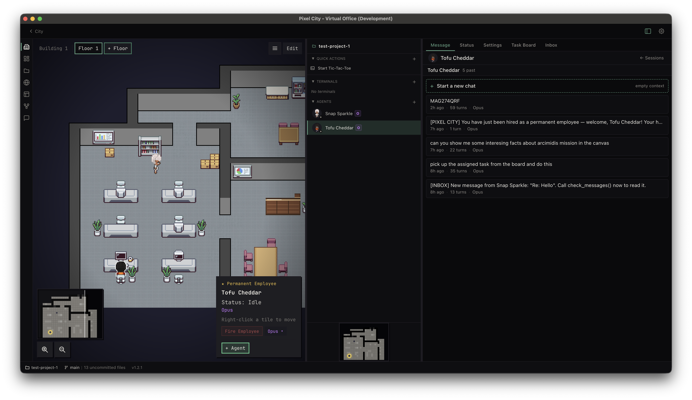
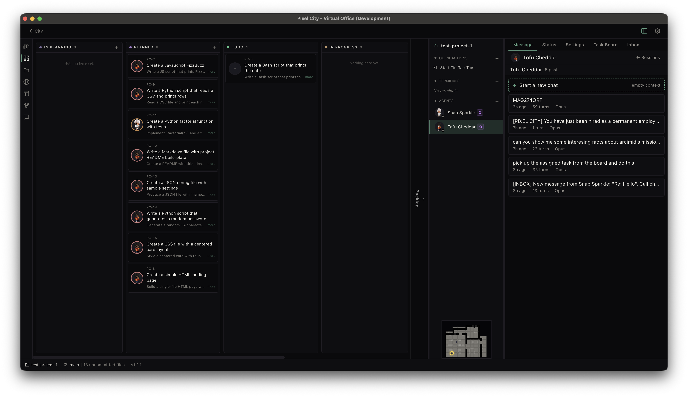
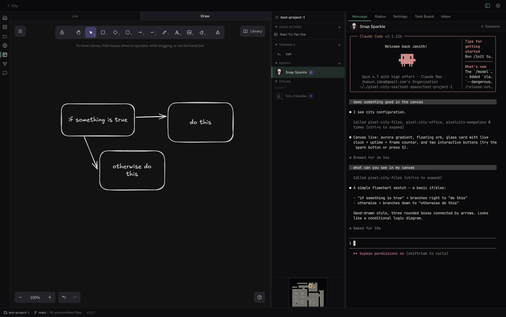
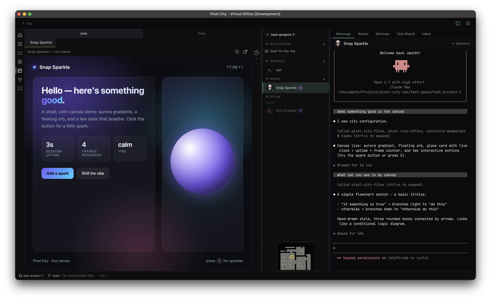

# Pixel City

A little pixel-art office for your coding agents. Runs on your machine, no cloud.

So here's the idea. You've probably got a few coding agents lying around — Claude Code, Codex CLI, that sort of thing. Pixel City takes those and drops them into a visual office, where each agent is an "employee" sitting at a desk. They run their terminals, edit your files, browse the web, scribble on a shared canvas, push tasks around a kanban board, and message each other — all from one Electron app.



---

## A quick tour

### The office

This is where it all happens. Each employee is a little pixel character at a desk — when they're working you can see them typing, when they're idle they wander around. Click anyone to open their terminal session, status, settings, or inbox on the right.

### The task board



A shared kanban board for you and your agents. Drop a card in *Planned* and an employee can pick it up, move it through *Todo* → *In Progress* → *Testing* → *Closed*, and write back results — all over MCP, no manual prompting needed.

### Canvas — sketch mode



The canvas is built on Excalidraw, so agents (and you) can sketch flowcharts, diagrams, ideas — the hand-drawn look is great for explaining things at a glance.

### Canvas — live mode



The same canvas can also render live HTML/CSS/JS. Ask an agent to "show me something" and they can throw together a little interactive demo — a gradient, a chart, a tiny game — right next to the conversation.

---

## What's in the box

- **Multi-agent terminals** — spin up as many `claude-code` or `codex-cli` sessions as you want. Each one's its own employee with its own state.
- **Plugins** — built-in stuff to actually get work done:
  - `board` — a kanban board you and your agents share
  - `canvas` — Excalidraw + an HTML canvas, so agents have somewhere to draw
  - `files` — file explorer with Monaco baked in
  - `git` — diff viewer and staging UI
  - `messages` — inbox so agents can talk to each other
  - `office` — the pixel office itself
- **MCP bridge** — the agents talk to the app over MCP. Tools for the board, browser, files, messages, quick actions — all handed to every agent automatically the moment it spawns.
- **MemPalace** — local vector memory (SQLite + embeddings). Permanent employees keep a diary, a knowledge graph, and can semantically search their own past. So they actually remember what you did last week.
- **Quick actions** — hook a script or a prompt up to a button in the office. One click, done.
- **Custom plugins** — drop a package in `packages/plugins/<name>` and the workspace picks it up.
- **Local-first** — everything lives in `~/.pixelcity/`. No accounts. No telemetry. No cloud.

---

## Before you start

You'll need:

- **Node.js** 20 or newer
- **pnpm** 9 or newer
- **macOS, Linux, or Windows** — I mainly develop on macOS / Apple Silicon, so that's the best-tested path
- One of these on your `PATH`:
  - [Claude Code](https://docs.anthropic.com/en/docs/claude-code), or
  - [Codex CLI](https://github.com/openai/codex)

A couple of native modules (`node-pty`, `better-sqlite3`) get rebuilt for Electron when you install. That's normal, just give it a minute.

---

## Get it running

```bash
# 1. Clone it
git clone https://github.com/jkasun/pixel-city.git
cd pixel-city

# 2. Install (pnpm handles the workspace and the Electron rebuild)
pnpm install

# 3. Fire it up
pnpm dev
```

That's it. The Electron window opens against `http://localhost:5913`. Pick a project folder, hire an employee, and they'll spin up a terminal session right inside the office.

### When you actually want to ship a build

```bash
pnpm build                              # build renderer + main + the bundled MCP servers
pnpm --filter pixel-city-terminal dist  # package an installer (electron-builder)
```

Per-platform shortcuts: `dist:mac`, `dist:win`, `dist:linux`.

---

## How the repo is laid out

```
pixel-city/
├── terminal-app/              The Electron app — main + renderer
│   ├── src/                   main process, IPC handlers, the React renderer
│   ├── mempalace-mcp-server/  bundled local memory MCP server
│   ├── system-prompts/        what we tell agents when they spawn
│   └── config.yml             ports, timeouts, terminal defaults
├── mcp-server/                The MCP servers we hand to spawned agents
│   └── servers/               board, browser, files, git, messages, office, plugins, quick-actions
├── packages/
│   ├── core/                  shared types, LLM provider interface, plugin SDK
│   ├── shared/                cross-process utilities
│   ├── ui/                    shared React components
│   └── plugins/               built-in plugins (board, canvas, files, git, messages, office)
├── pixelcity.mcp.json         drop your own MCP servers in here
└── pnpm-workspace.yaml
```

---

## Adding your own MCP servers

There's a `pixelcity.mcp.json` at the root. Whatever you put in there gets merged into the agent's `.mcp.json` every time it spawns. Same shape as a normal MCP config:

```json
{
  "mcpServers": {
    "my-tool": {
      "command": "node",
      "args": ["/absolute/path/to/server.js"]
    }
  }
}
```

That's the whole story.

---

## Writing your own plugin

A plugin's just a workspace package under `packages/plugins/<name>`. It exports a manifest, a React component, and — if you want — some MCP tool handlers. The easiest way in is to look at the ones that ship (`board`, `canvas`, `files`); they all use the same `@pixel-city/core` plugin SDK.

```ts
// packages/plugins/my-plugin/src/index.ts
import { definePlugin } from '@pixel-city/core/plugin';
import { MyPanel } from './components/MyPanel';

export default definePlugin({
  id: 'my-plugin',
  name: 'My Plugin',
  component: MyPanel,
});
```

Then add it to `terminal-app/package.json` as `"@pixel-city/plugin-my-plugin": "workspace:*"` and register it in the renderer's plugin registry. Done.

---

## Configuration & where things live

Most of the runtime knobs are in `terminal-app/config.yml` — ports, terminal scrollback, MCP timeouts, window size. Your actual data sits in:

- `~/.pixelcity/app.db` — SQLite for boards, agents, plugin state
- `~/.pixelcity/agents/<id>/` — per-agent project bindings and metadata
- `~/.pixelcity/mempalace/` — vector memory (one wing per permanent employee)

Want to nuke any of it? Just delete the file or folder. That bit of state resets.

---

## Want to contribute?

Please do. A few small asks:

- One feature or fix per PR. Keep them focused.
- Run `pnpm --filter <pkg> typecheck` before you push.
- New plugins go under `packages/plugins/` and follow the same shape as the existing ones.
- The renderer's React 19 + Tailwind 4. The main process is plain TypeScript.

---

## License

[FSL-1.1-Apache-2.0](LICENSE) — Functional Source License. It flips to Apache 2.0 two years after each release. Short version: use it, modify it, redistribute it, do whatever — just don't turn around and sell it as a competing product.

Copyright © 2026 Janith Kasun.

---

## Thank-yous

Pixel City stands on a *lot* of great open source. Massive thanks to the people behind:

- **[pixel-agents](https://github.com/pablodelucca/pixel-agents)** by [Pablo de Lucca](https://github.com/pablodelucca) — the pixel character work that inspired the office. Go check it out.
- **[Electron](https://www.electronjs.org/)** — the desktop runtime that makes any of this possible
- **[React](https://react.dev/)** and **[Vite](https://vitejs.dev/)** — the UI and the dev loop
- **[Excalidraw](https://github.com/excalidraw/excalidraw)** — the hand-drawn canvas
- **[Monaco Editor](https://github.com/microsoft/monaco-editor)** (and [`@monaco-editor/react`](https://github.com/suren-atoyan/monaco-react)) — code editor and diff view
- **[xterm.js](https://xtermjs.org/)** — the terminal emulator
- **[node-pty](https://github.com/microsoft/node-pty)** — pseudo-terminal bindings
- **[better-sqlite3](https://github.com/WiseLibs/better-sqlite3)** — local storage for the app and memory
- **[isomorphic-git](https://isomorphic-git.org/)** and **[simple-git](https://github.com/steveukx/git-js)** — git
- **[Model Context Protocol](https://modelcontextprotocol.io/)** ([SDK](https://github.com/modelcontextprotocol/typescript-sdk)) — the agent ↔ app tool bridge
- **[Tailwind CSS](https://tailwindcss.com/)**, **[react-arborist](https://github.com/brimdata/react-arborist)**, **[Split.js](https://split.js.org/)**, **[marked](https://marked.js.org/)**, **[highlight.js](https://highlightjs.org/)**, **[DOMPurify](https://github.com/cure53/DOMPurify)**, **[js-yaml](https://github.com/nodeca/js-yaml)**, **[ws](https://github.com/websockets/ws)**, **[Zod](https://zod.dev/)**

…and a long tail of transitive dependencies I didn't list. License texts for everything bundled ship inside the packaged app via `node_modules`. If you maintain any of this stuff: seriously, thank you.
